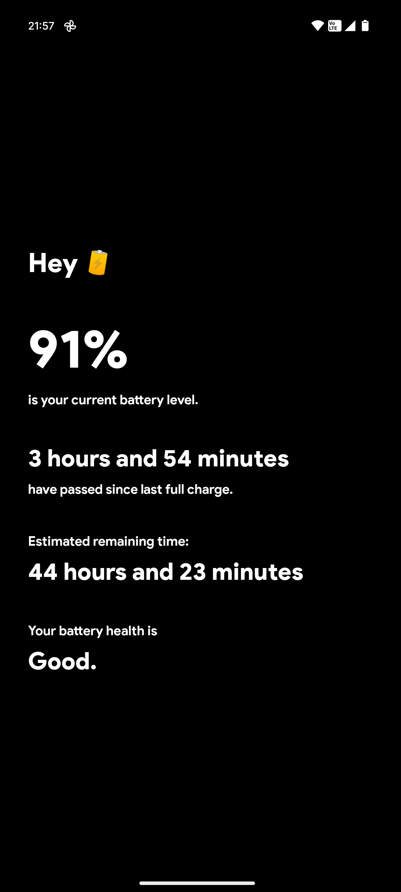
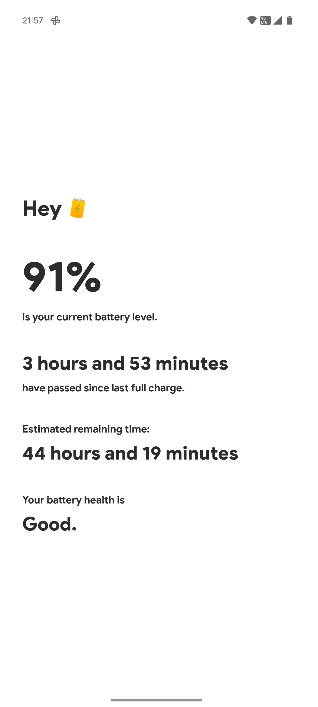

# HeyBattery 🔋

A beautiful and minimalist Android app to track your battery statistics and estimate remaining battery life.

## Features

- **Real-time Battery Monitoring** - Track current battery level and health
- **Smart Time Predictions** - Estimates remaining battery time based on your usage patterns
- **Historical Data Tracking** - Stores up to 30 charge cycles in JSON format
- **Dark Mode Support** - Automatically adapts to your device theme

## Screenshots

 


## How It Works

The app monitors your battery usage and learns from your charging cycles to provide accurate time estimates. All data is stored locally on your device in a JSON file (`charge_cycles.json`).

### Tracking Logic

1. When battery reaches 100% while charging, the app marks it
2. When you unplug the phone, the timer starts
3. The app continuously updates predictions based on your actual usage
4. Historical data from previous cycles improves accuracy over time

## Installation

1. Download the latest APK from the [Releases](../../releases) page
2. Enable "Install from unknown sources" in your Android settings
3. Install the APK
4. Grant the requested permissions for accurate tracking

## Permissions

- **BATTERY_STATS** - To read battery information
- **RECEIVE_BOOT_COMPLETED** - To start monitoring after device restart
- **FOREGROUND_SERVICE** - To run background battery monitoring
- **POST_NOTIFICATIONS** - For the monitoring service notification

## Building from Source

### Prerequisites

- Android Studio Arctic Fox or later
- Android SDK (API 24+)
- Gradle 8.0+

### Build Steps

1. Clone the repository:
   ```bash
   git clone https://github.com/YOUR_USERNAME/BatteryStats.git
   cd BatteryStats
   ```

2. Open the project in Android Studio

3. Build the APK:
   - Go to **Build → Generate Signed Bundle / APK**
   - Select **APK**
   - Follow the signing process

## Tech Stack

- **Language**: Java
- **Min SDK**: Android 7.0 (API 24)
- **Target SDK**: Android 14 (API 34)
- **Architecture**: Service-based background monitoring
- **Data Storage**: JSON files + SharedPreferences
- **UI**: Material Design Components

## Features in Detail

### Charge Cycle Tracking
Each charge cycle stores:
- Timestamp of full charge
- Starting battery level
- Duration of use
- Ending battery level
- Calculated drain rate

### Theme System
- System Default (follows device setting)
- Always Light mode
- Always Dark mode
- Access via easter egg: Tap "Hey" 5 times in 2 seconds

## Contributing

Contributions are welcome! Please feel free to submit a Pull Request.

## License

This project is open source and available under the [MIT License](LICENSE).

## Author

Created with ❤️

## Acknowledgments

- Product Sans font by Google
- Battery icon design
