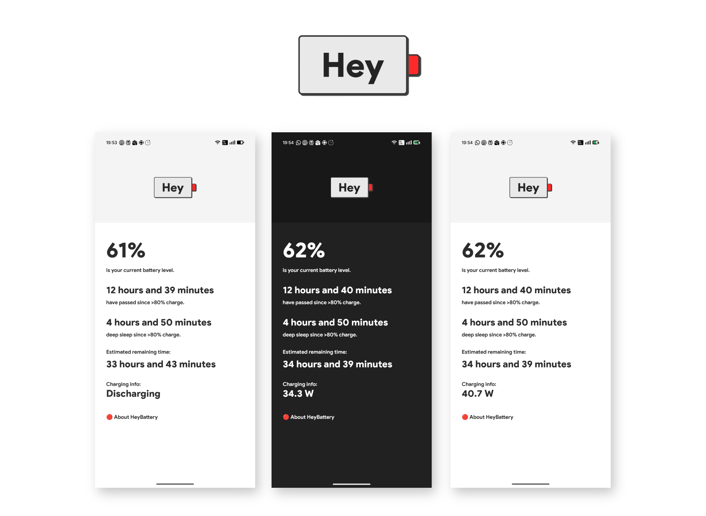

# HeyBattery

A lightweight Android app that tracks your battery usage and charging behavior.

## Features
- Shows current battery percentage.
- Tracks time since last charge above 80%.
- Calculates deep sleep duration using *(elapsedRealtime – uptimeMillis)*.
- Estimates remaining usage time based on previous usage cycles.
- Displays real-time charging info.
- Tap charging info to cycle between **Watts → Volts → mA**.
- Dynamic refresh:
  - **3s** updates while charging
  - **60s** updates while discharging
- Clean UI with light/dark theme support.
- Scrollable About screen with detailed explanations.
