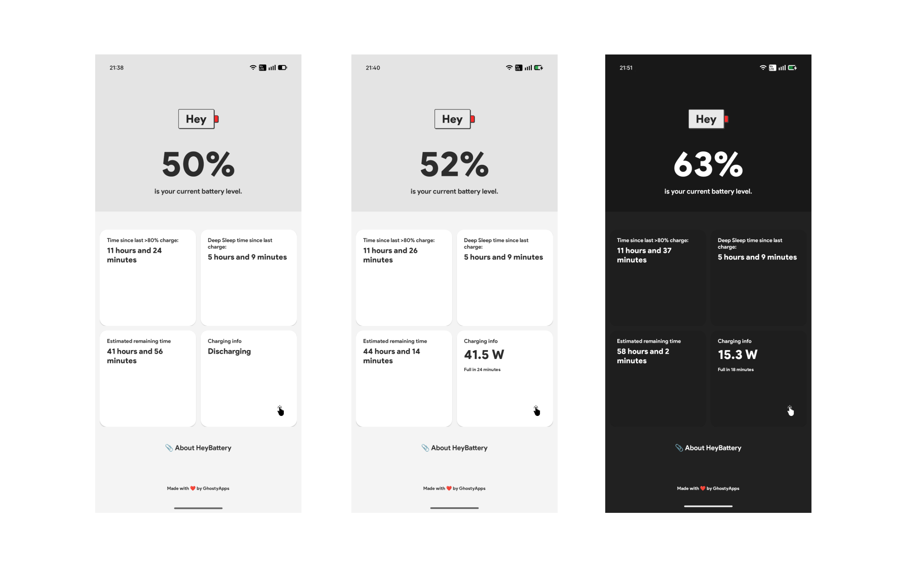

# 🔋 HeyBattery

**Precision Without the Drain.**

Most battery apps drain your power just to measure it. HeyBattery is different. Designed with a **"Zero-Drain"** philosophy, it monitors your battery health, deep sleep cycles, and charging speeds without running heavy background services.

  

## ✨ Key Features

* **⚡ Zero Background Drain:** No persistent services running in the background. We calculate stats mathematically using system timestamps only when you open the app.
* **💤 True Deep Sleep Tracking:** Accurately measures how long your device's CPU stays in deep sleep mode to identify rogue apps causing battery drain.
* **📊 Hybrid Prediction Model:** Estimates remaining battery time by combining your long-term usage history (40%) with your current session's drain rate (60%).
* **🔌 Real-Time Charging Stats:** Monitor live Voltage, Watts, and Temperature while charging.
* **🛡️ Battery Health Protection:** Passive tracking of charge cycles.
* **🕵️ 100% Private:** No internet permission required. No data leaves your device.

## 🛠️ How It Works (The Engineering)

HeyBattery respects Android's modern architecture:

1.  **JobScheduler & Passive Monitoring:** Instead of keeping a service alive, we schedule a system job that only triggers momentarily when you plug/unplug the charger.
2.  **Boot Signature:** We track device reboots using a unique boot timestamp signature to prevent data corruption during restarts.
3.  **Delta Calculation:** Deep sleep and usage stats are calculated retroactively using kernel counters (`elapsedRealtime` vs `uptimeMillis`), ensuring 0% battery impact.

## 📥 Download

You can clone this repo and build it using Android Studio, or download the latest APK from the releases page:

[**👉 Download Latest Release**](https://github.com/ghostyapps/HeyBattery/releases)

---
*Made with ❤️ by GhostyApps*