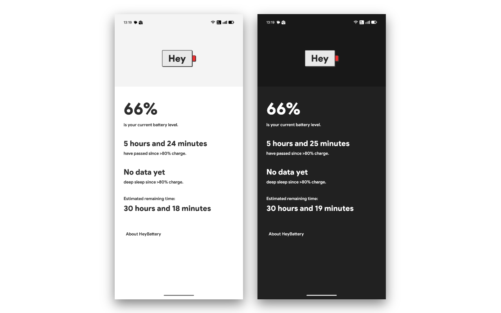

# HeyBattery – Simple, Smart Battery Tracking

HeyBattery is a lightweight and privacy-friendly Android battery companion that helps you understand your device’s power usage without unnecessary permissions or background services.

It focuses on clarity, simplicity, and meaningful battery insights.

---

## 🔋 Features

### ✔ Current Battery Percentage
Displays your real-time battery percentage in a clean, minimal UI.

### ✔ Time Since Last ≥80% Charge
HeyBattery automatically detects the moment your device reaches **80% or above while charging**, then begins tracking how much time has passed since that moment.

This gives you a realistic look at your battery cycle usage.

### ✔ Deep Sleep Tracking
Uses the Android formula:

elapsedRealtime - uptimeMillis

This tells you how long your phone has actually been in **deep sleep** (CPU fully idle) since the last ≥80% charge.

If the screen is off but an app keeps your CPU active, deep sleep **does not increase** — a great way to detect background drain.

### ✔ Estimated Remaining Time
Estimates how long the device may run based on:

- Your previous usage patterns  
- Current battery percentage  
- Recent cycle behavior  

Updated continuously in real time.

### ✔ Full Light/Dark Theme Support
The entire UI — background, text, header, icons, and system bars — follows the system theme using Android’s DayNight system.

### ✔ Clean, No-Nonsense UI
No ads.  
No analytics.  
No unnecessary permissions.  
No background battery drain.

---

## 🖥 Screenshots


---

## 📦 Download
You can download the latest signed APK from:

👉 **[Releases](../../releases/latest)**

---

## 🛠 Tech Stack

- **Android Studio / Kotlin (or Java if applicable)**
- Material Components
- ConstraintLayout UI
- SharedPreferences for persistent tracking
- BatteryManager API

---

## ⚙️ How It Works

### Battery Percentage
Polled via `ACTION_BATTERY_CHANGED`.

### Deep Sleep
Calculated using:
```java
SystemClock.elapsedRealtime() - SystemClock.uptimeMillis();
